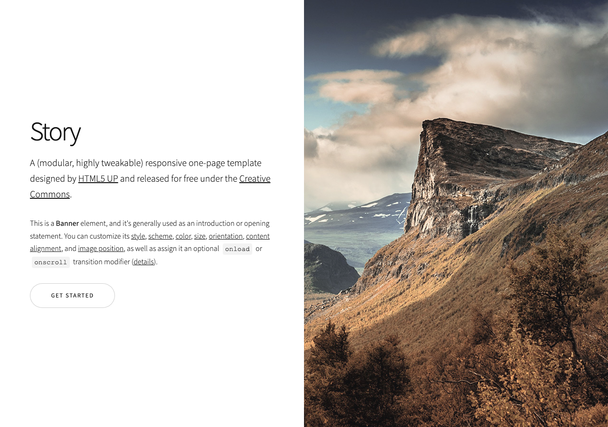
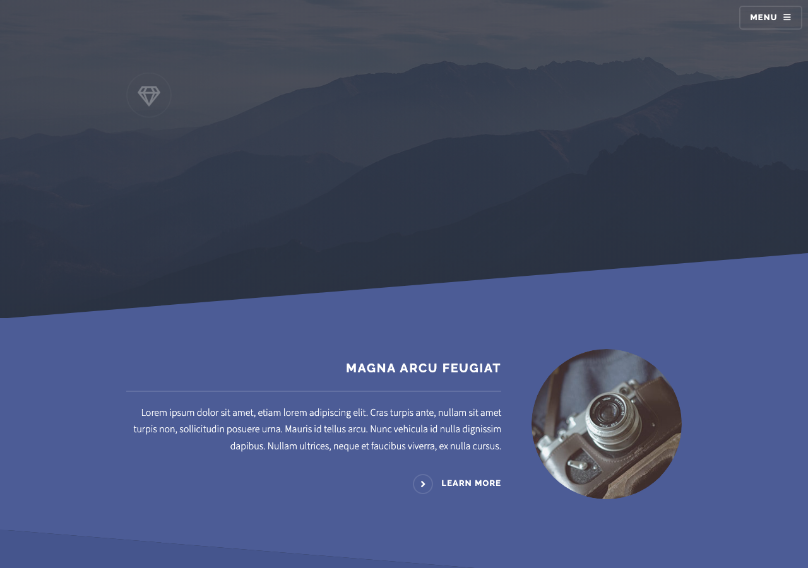
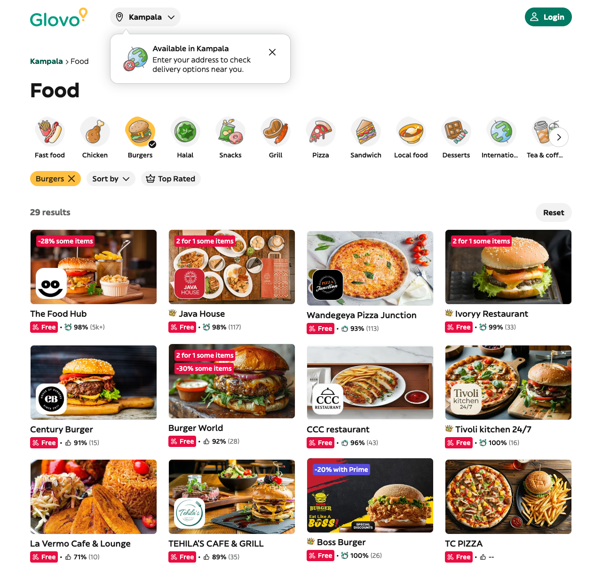
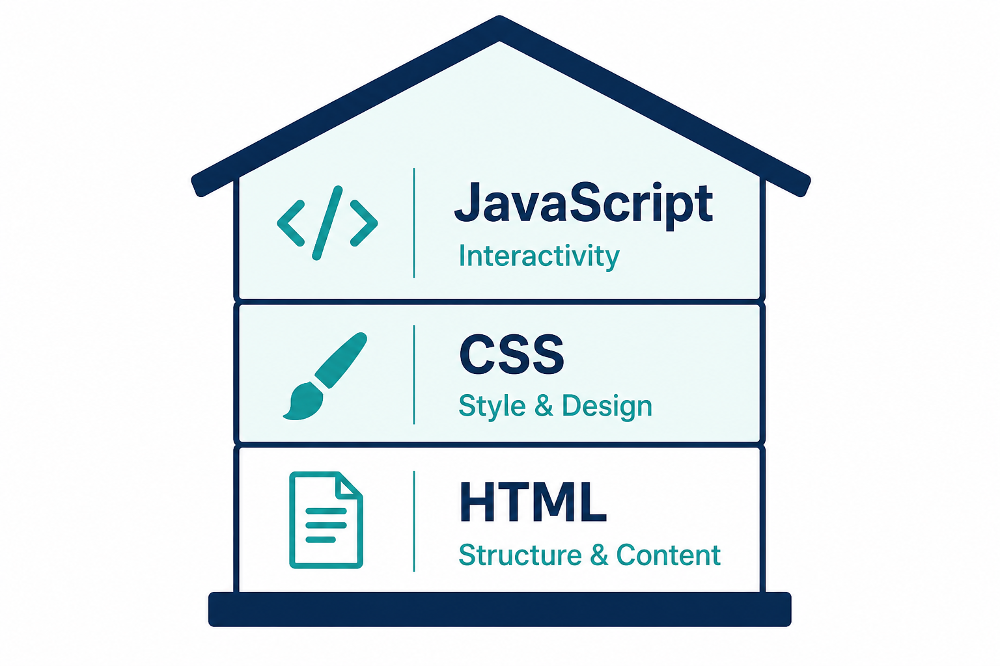
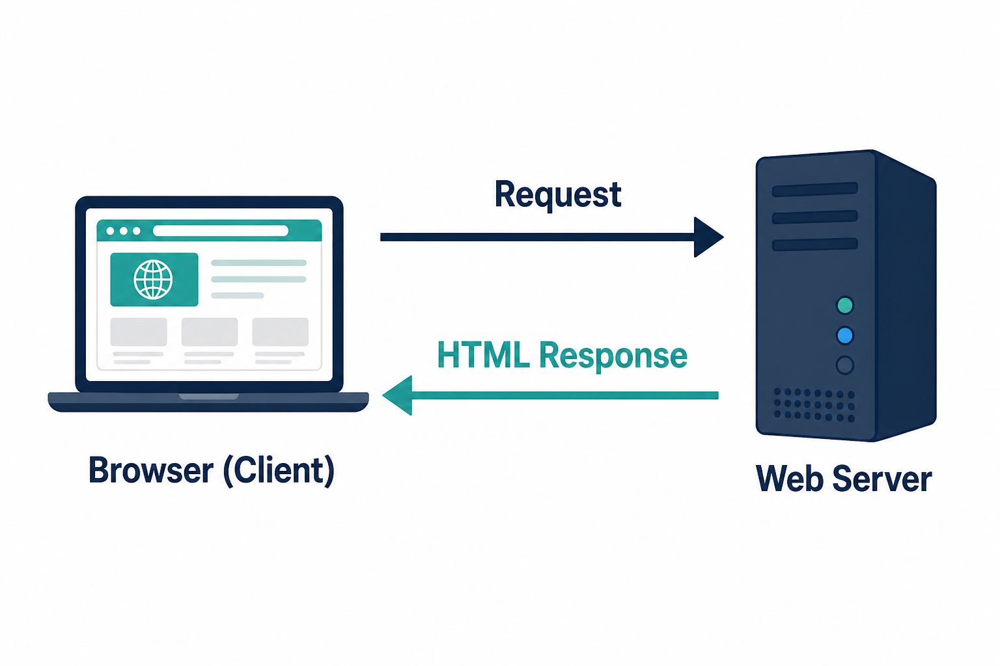
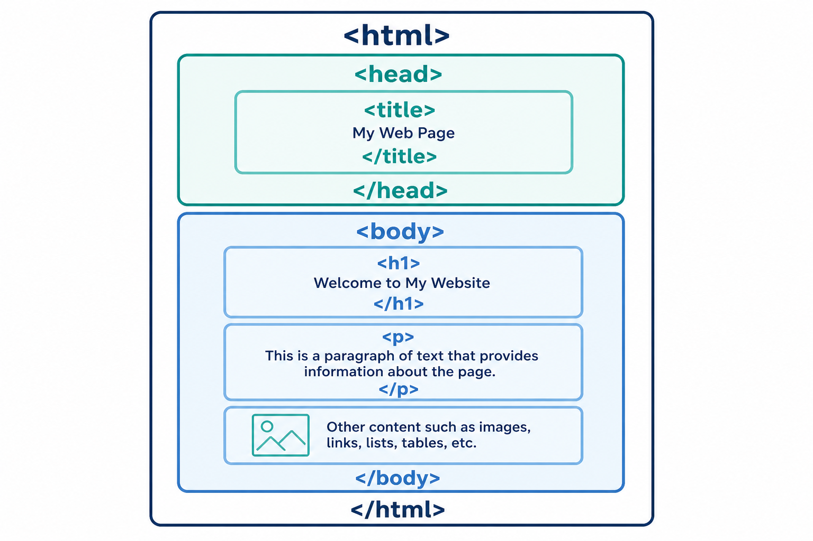
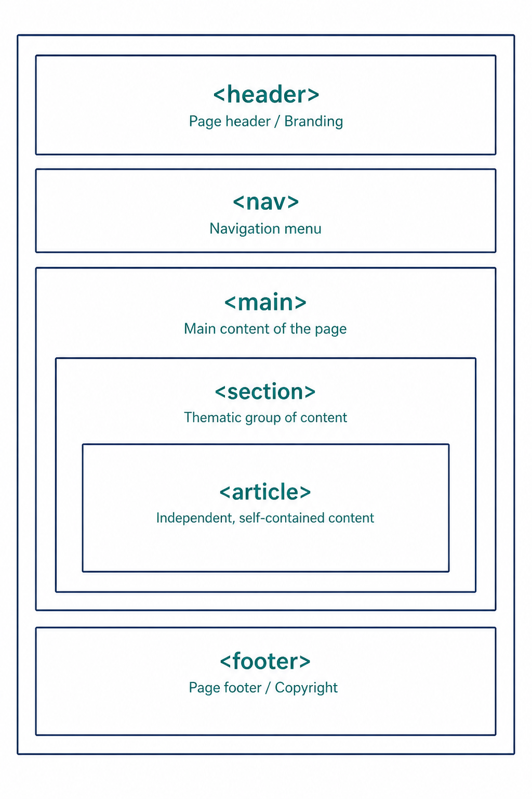

# Course: Introduction to HTML

## Course Goal

By the end of this course, students should be able to create a well-structured static webpage using HTML, including text, lists, links, images, tables, forms, and semantic HTML.

## Final Project

Build a complete personal/profile website using **only HTML**.

---

## Course Overview

| Chapter | Title | Main Skill |
|---------|-------|------------|
| 1 | Introduction to HTML | Understand HTML |
| 2 | HTML Document Structure | Build HTML pages |
| 3 | Text and Content | Add webpage content |
| 4 | HTML Lists | Organize information |
| 5 | Links & Navigation | Connect webpages |
| 6 | Images & Attributes | Add media |
| 7 | HTML Comments | Document code |
| 8 | HTML Tables | Display structured data |
| 9 | HTML Forms | Collect user input |
| 10 | Semantic HTML | Build meaningful page structure |
| 11 | HTML Practice Project | Build a complete website |

---

## Tools Required

Before starting, students need:

- **VS Code** — code editor
- **Chrome browser** — for viewing and testing pages
- **GitHub account** — for storing and sharing projects

<!-- IMAGE NEEDED: Screenshot of VS Code welcome/editor screen -->
<!-- IMAGE NEEDED: Screenshot of Google Chrome browser -->
<!-- IMAGE NEEDED: Screenshot of GitHub homepage or signup/profile page -->

---

# Chapter 1 — Introduction to HTML

## Learning Outcome

Student understands the purpose of HTML and can create and view a basic HTML file.

## Topics

- What is HTML?
- What is HTML used for?
- HTML vs CSS vs JavaScript
- How a website is built
- HTML elements
- Basic HTML syntax
- Tools required:
  - VS Code
  - Chrome browser
  - GitHub account

## Basic Website Examples

Before we write code, look at real websites.

These examples show what people build with HTML (and related web technologies). Your final project will be simpler — but this is the direction you are heading.

### Example 1: A personal / portfolio-style page

Many personal websites introduce someone with a heading, short description, image, and a button or link.



**What to notice:** a clear heading, introduction text, image, and call-to-action link/button.

### Example 2: A business landing page

Companies use websites to present who they are and invite visitors to learn more.



**What to notice:** logo/navigation area, large image, heading, paragraph, and “Learn more” link.

### Example 3: Explore Uganda

Local and tourism websites use HTML to share destinations, experiences, and travel information.


**What to notice:** logo, navigation links, contact details, and a large hero image/video area.

### Example 4: A restaurant / food delivery page

Food delivery websites list restaurants, food categories, ratings, and images — all built with HTML structure.



**Source:** [Glovo — Burgers in Kampala](https://glovoapp.com/en/ug/kampala/categories/food_1?type=burgers_34789)

**What to notice:** navigation, food category links, restaurant cards, images, headings, and organized lists of options.

> By the end of this course, you will build your own multi-page personal website using HTML.

## What is HTML?

**HTML** stands for **HyperText Markup Language**.

It is the language used to create the structure and content of webpages.

HTML tells the browser:

- What text should appear
- What is a heading
- What is a paragraph
- Where images go
- Which text is a link

## HTML vs CSS vs JavaScript

Think of a website like a house:

| Technology | Role |
|------------|------|
| HTML | Structure (walls, rooms, foundation) |
| CSS | Style (paint, furniture, decorations) |
| JavaScript | Interactivity (lights, doors, appliances) |



> In this course, we focus on **HTML only**. CSS and JavaScript come later.

## How a Website Is Built

```
You (Browser) → Internet → Server → Files → Back to You
```

1. You type a website address in Chrome.
2. The browser requests the page from a server.
3. The server sends HTML files back.
4. The browser displays the page.



## Basic HTML Syntax

HTML uses **elements** made of tags.

Example:

```html
<p>This is a paragraph.</p>
```

- `<p>` = opening tag
- `This is a paragraph.` = content
- `</p>` = closing tag

<!-- IMAGE NEEDED: Diagram of an HTML element (opening tag + content + closing tag) -->

## Practical

1. Set up VS Code
2. Create the first `.html` file
3. Open the page in Chrome
4. Make the browser display your first content

<!-- IMAGE NEEDED: Screenshot of creating/saving an .html file in VS Code -->
<!-- IMAGE NEEDED: Screenshot of the same page open in Chrome showing "Hello, World!" -->

### Starter Code

```html
<!DOCTYPE html>
<html>
<head>
    <title>My First Page</title>
</head>
<body>
    <h1>Hello, World!</h1>
    <p>This is my first HTML page.</p>
</body>
</html>
```

## Chapter Checkpoint

- [ ] I can explain what HTML is used for
- [ ] I understand the difference between HTML, CSS, and JavaScript
- [ ] I can create an HTML file and open it in Chrome

---

# Chapter 2 — HTML Document Structure

## Learning Outcome

Student can build a correct basic HTML page from scratch.

## Topics

- `<!DOCTYPE html>`
- `<html>`
- `<head>`
- `<body>`
- Understanding opening and closing tags
- Nesting elements
- Basic HTML page structure

## The Basic HTML Page

Every HTML page follows this structure:

```html
<!DOCTYPE html>
<html>
<head>
    <title>Page Title</title>
</head>
<body>
    <!-- Visible content goes here -->
</body>
</html>
```



## Understanding Each Part

| Part | Purpose |
|------|---------|
| `<!DOCTYPE html>` | Tells the browser this is an HTML5 document |
| `<html>` | The root container for the whole page |
| `<head>` | Information about the page (title, settings) |
| `<title>` | Appears in the browser tab |
| `<body>` | Everything the user sees on the page |

## Nesting Elements

Elements can go inside other elements.

```html
<body>
    <h1>Welcome</h1>
    <p>This paragraph is nested inside the body.</p>
</body>
```

Rule: Close tags in the reverse order they were opened.

## Practical

Create a basic HTML page from scratch.

## Exercise

Create a page containing:

- Page title
- Main heading
- Introduction paragraph

### Example Target

```html
<!DOCTYPE html>
<html>
<head>
    <title>About Me</title>
</head>
<body>
    <h1>Welcome to My Page</h1>
    <p>This is my introduction paragraph.</p>
</body>
</html>
```

## Chapter Checkpoint

- [ ] I can write a full HTML document structure
- [ ] I understand what `head` and `body` are for
- [ ] I can nest elements correctly

---

# Chapter 3 — Text and Content

## Learning Outcome

Student can add readable text content using headings, paragraphs, and basic formatting.

## Topics

- Headings: `<h1>`–`<h6>`
- Paragraphs: `<p>`
- `<span>`
- Basic text formatting
- Creating readable content

## Headings

HTML has six heading levels:

```html
<h1>Main Title</h1>
<h2>Section Title</h2>
<h3>Subsection</h3>
<h4>Smaller Heading</h4>
<h5>Even Smaller</h5>
<h6>Smallest Heading</h6>
```

Use `<h1>` once per page for the main title.

<!-- IMAGE NEEDED: Browser preview showing heading sizes h1 to h6 -->

## Paragraphs

```html
<p>This is a paragraph of text.</p>
<p>This is another paragraph.</p>
```

## Span

`<span>` is used to mark a small piece of text inside a larger block.

```html
<p>I am learning <span>HTML</span> this week.</p>
```

## Basic Text Formatting

| Tag | Purpose | Example |
|-----|---------|---------|
| `<strong>` | Important / bold meaning | `<strong>Important</strong>` |
| `<em>` | Emphasis / italic meaning | `<em>emphasized</em>` |
| `<br>` | Line break | `Line 1<br>Line 2` |

<!-- IMAGE NEEDED: Browser preview comparing normal, strong, and emphasized text -->

## Practical

Create a simple **About Me** page.

## Exercise

Students create a page with:

- Name
- Short biography
- Hobbies
- Goals

### Suggested Structure

```html
<h1>Jane Doe</h1>
<h2>About Me</h2>
<p>Short biography goes here.</p>

<h2>Hobbies</h2>
<p>Reading, coding, and football.</p>

<h2>Goals</h2>
<p>Become a web developer.</p>
```

## Chapter Checkpoint

- [ ] I can use headings correctly
- [ ] I can write paragraphs
- [ ] I can create a simple About Me page

---

# Chapter 4 — HTML Lists

## Learning Outcome

Student can organize information using unordered, ordered, and description lists.

## Topics

- Unordered lists `<ul>`
- Ordered lists `<ol>`
- List items `<li>`
- Description lists `<dl>`, `<dt>`, `<dd>`

## Unordered Lists

Use when order does not matter.

```html
<ul>
    <li>HTML</li>
    <li>CSS</li>
    <li>JavaScript</li>
</ul>
```

Displays as:

- HTML
- CSS
- JavaScript

<!-- IMAGE NEEDED: Browser screenshot of an unordered list -->

## Ordered Lists

Use when order matters.

```html
<ol>
    <li>Open VS Code</li>
    <li>Create a file</li>
    <li>Write HTML</li>
</ol>
```

Displays as:

1. Open VS Code
2. Create a file
3. Write HTML

<!-- IMAGE NEEDED: Browser screenshot of an ordered list -->

## Description Lists

Use for terms and definitions.

```html
<dl>
    <dt>HTML</dt>
    <dd>A language for structuring webpages.</dd>

    <dt>Browser</dt>
    <dd>A program used to view websites.</dd>
</dl>
```

<!-- IMAGE NEEDED: Browser screenshot of a description list -->

## Practical

Create:

- Favorite foods list
- Daily routine
- Steps for completing a task
- Skills list

## Mini Project: My Favorite Things

Create a webpage that includes:

- Favorite foods (`<ul>`)
- Morning routine (`<ol>`)
- Definitions of a few tech terms (`<dl>`)

## Chapter Checkpoint

- [ ] I can create unordered lists
- [ ] I can create ordered lists
- [ ] I can create description lists

---

# Chapter 5 — Links and Navigation

## Learning Outcome

Student can connect multiple pages using absolute and relative links.

## Topics

- The `<a>` element
- URLs
- Absolute links
- Relative links
- Linking to other pages
- Opening links

## The Anchor Element

```html
<a href="https://www.google.com">Visit Google</a>
```

- `href` = the destination
- The text between tags = what the user clicks

## Absolute vs Relative Links

| Type | Example | Use When |
|------|---------|----------|
| Absolute | `https://github.com` | Linking to an external website |
| Relative | `about.html` | Linking to a page in your project |

<!-- IMAGE NEEDED: Diagram comparing absolute URL vs relative path -->

## Opening Links in a New Tab

```html
<a href="https://developer.mozilla.org" target="_blank">MDN Web Docs</a>
```

## Practical

Create multiple HTML pages:

- `index.html`
- `about.html`
- `contact.html`

Connect them using links.

### Example Navigation

```html
<ul>
    <li><a href="index.html">Home</a></li>
    <li><a href="about.html">About</a></li>
    <li><a href="contact.html">Contact</a></li>
</ul>
```

<!-- IMAGE NEEDED: Diagram of 3 linked pages (index.html ↔ about.html ↔ contact.html) -->

## Mini Project: 3-Page Personal Website

Build a simple website with:

1. Home page
2. About page
3. Contact page

All pages must link to each other.

## Chapter Checkpoint

- [ ] I understand absolute and relative links
- [ ] I can connect multiple pages
- [ ] I can open external links in a new tab

---

# Chapter 6 — Images and HTML Attributes

## Learning Outcome

Student can add images and understand common HTML attributes.

## Topics

- What are attributes?
- `src`
- `alt`
- `width`
- `height`
- Understanding `name="value"`
- Image file paths
- Local images vs online images

## What Are Attributes?

Attributes give extra information to an element.

```html

```

Format:

```
name="value"
```

<!-- IMAGE NEEDED: Annotated screenshot of an  tag highlighting src, alt, width, height -->

## Important Image Attributes

| Attribute | Purpose |
|-----------|---------|
| `src` | Image location |
| `alt` | Text description (accessibility + fallback) |
| `width` | Image width |
| `height` | Image height |

## Local vs Online Images

**Local image:**

```html

```

**Online image:**

```html

```

## Why `alt` Matters

- Helps screen readers describe images
- Shows text if the image fails to load
- Improves accessibility

<!-- IMAGE NEEDED: Side-by-side image showing broken image icon vs useful alt text -->

## Recommended Folder Structure

```
my-website/
├── index.html
├── about.html
├── contact.html
└── images/
    ├── profile.jpg
    └── hobby.jpg
```

<!-- IMAGE NEEDED: Screenshot of a project folder showing html files + images folder -->

## Practical

Add:

- Profile picture
- Hobby images
- Product images

## Exercise

Create a simple personal profile page containing:

- Text
- Links
- Images

## Chapter Checkpoint

- [ ] I understand what attributes are
- [ ] I can add images with `src` and `alt`
- [ ] I can use local image paths correctly

---

# Chapter 7 — HTML Comments

## Learning Outcome

Student can document HTML code using comments.

## Topics

- What comments are
- Why developers use comments
- HTML comment syntax
- `<!-- This is a comment -->`

## HTML Comment Syntax

```html
<!-- This is a comment -->
```

Comments:

- Are **not** displayed in the browser
- Help developers understand the code
- Can temporarily hide code during testing

## Example

```html
<body>
    <!-- Main heading -->
    <h1>Welcome</h1>

    <!-- Introduction section -->
    <p>This is my portfolio website.</p>
</body>
```

<!-- IMAGE NEEDED: Split view — code with comments on left, browser on right (comments not visible) -->

## Practical

Add useful comments to an existing webpage.

Examples of useful comments:

- Mark major sections
- Explain why something was done
- Leave notes for future updates

## Chapter Checkpoint

- [ ] I can write HTML comments
- [ ] I understand that comments are not shown in the browser
- [ ] I can use comments to organize my code

---

# Chapter 8 — HTML Tables

## Learning Outcome

Student can display structured data using HTML tables.

## Topics

- `<table>`
- `<thead>`
- `<tbody>`
- `<tr>`
- `<td>`
- Creating rows and columns
- Understanding when tables are appropriate

## Basic Table Structure

```html
<table>
    <thead>
        <tr>
            <th>Name</th>
            <th>Score</th>
        </tr>
    </thead>
    <tbody>
        <tr>
            <td>Alice</td>
            <td>90</td>
        </tr>
        <tr>
            <td>Brian</td>
            <td>85</td>
        </tr>
    </tbody>
</table>
```

<!-- IMAGE NEEDED: Browser screenshot of a rendered HTML table (marks or timetable) -->

## Table Elements

| Element | Purpose |
|---------|---------|
| `<table>` | Creates the table |
| `<thead>` | Header section |
| `<tbody>` | Body section |
| `<tr>` | Table row |
| `<th>` | Header cell |
| `<td>` | Data cell |

## When to Use Tables

Use tables for:

- Marks and scores
- Timetables
- Price lists
- Structured comparison data

Do **not** use tables just to design page layouts.

## Practical

Create:

- Student marks table
- Class timetable
- Product price table

## Mini Project: Student Report Card

Create a report card table with:

- Student name
- Subjects
- Marks
- Grade or status

## Chapter Checkpoint

- [ ] I can create a table with rows and columns
- [ ] I understand `thead`, `tbody`, `tr`, `th`, and `td`
- [ ] I know when tables are appropriate

---

# Chapter 9 — HTML Forms

## Learning Outcome

Student can build forms that collect user information.

## Topics

- What HTML forms are
- `<form>`
- `action`
- `method`
- `<label>`
- `<input>`
- Input types:
  - `text`
  - `email`
  - `password`
- Form structure

## What Are Forms?

Forms collect user information.

Common examples:

- Login forms
- Registration forms
- Contact forms
- Surveys
- Job application forms

<!-- IMAGE NEEDED: Screenshot of a real login or registration form (e.g. GitHub login / school portal) -->

## Basic Form Structure

```html
<form action="/submit" method="post">
    <label for="fullname">Full Name:</label>
    <input type="text" id="fullname" name="fullname">

    <label for="email">Email:</label>
    <input type="email" id="email" name="email">

    <button type="submit">Submit</button>
</form>
```

## Important Form Attributes

| Attribute | Purpose |
|-----------|---------|
| `action` | Where the form data is sent |
| `method` | How the data is sent (`get` or `post`) |
| `name` | Identifies the input field |
| `type` | Defines the kind of input |

## Common Input Types

| Type | Use |
|------|-----|
| `text` | Names and short text |
| `email` | Email addresses |
| `password` | Hidden passwords |
| `radio` | Choose one option |
| `checkbox` | Choose multiple options |
| `date` | Date of birth |
| `submit` | Send the form |

<!-- IMAGE NEEDED: Visual of common input types (text, email, password, radio, checkbox, date) -->

## Practical

Build a registration form.

## Exercise

Create a form containing:

- Full name
- Email
- Password
- Phone number
- Gender
- Date of birth
- Submit button

### Example Starter

```html
<form action="#" method="post">
    <label for="fullname">Full Name</label>
    <input type="text" id="fullname" name="fullname">

    <label for="email">Email</label>
    <input type="email" id="email" name="email">

    <label for="password">Password</label>
    <input type="password" id="password" name="password">

    <label for="phone">Phone Number</label>
    <input type="text" id="phone" name="phone">

    <p>Gender</p>
    <input type="radio" id="male" name="gender" value="male">
    <label for="male">Male</label>

    <input type="radio" id="female" name="gender" value="female">
    <label for="female">Female</label>

    <label for="dob">Date of Birth</label>
    <input type="date" id="dob" name="dob">

    <button type="submit">Register</button>
</form>
```

<!-- IMAGE NEEDED: Browser screenshot of the completed registration form rendered in Chrome -->

## Chapter Checkpoint

- [ ] I understand what forms are for
- [ ] I can use labels and inputs together
- [ ] I can build a registration form

---

# Chapter 10 — Semantic HTML

## Learning Outcome

Student can restructure a webpage using meaningful semantic HTML tags.

## Topics

- What semantic HTML means
- Why semantic HTML matters
- `<header>`
- `<nav>`
- `<main>`
- `<section>`
- `<article>`
- `<footer>`

## What Is Semantic HTML?

Semantic HTML uses tags that describe the **meaning** of content.

Instead of only using `<div>` everywhere, we use tags that explain the role of each part.

## Why Semantic HTML Matters

- Improves readability
- Helps SEO
- Makes code easier to maintain
- Improves accessibility

## Common Semantic Elements

| Element | Purpose |
|---------|---------|
| `<header>` | Top section of a page or section |
| `<nav>` | Navigation links |
| `<main>` | Main content of the page |
| `<section>` | A themed group of content |
| `<article>` | Independent content block |
| `<footer>` | Bottom section of a page |



## Example Structure

```html
<header>
    <h1>My Portfolio</h1>
    <nav>
        <ul>
            <li><a href="index.html">Home</a></li>
            <li><a href="about.html">About</a></li>
            <li><a href="contact.html">Contact</a></li>
        </ul>
    </nav>
</header>

<main>
    <section>
        <h2>About Me</h2>
        <p>Short introduction.</p>
    </section>

    <article>
        <h2>My Latest Project</h2>
        <p>Project description.</p>
    </article>
</main>

<footer>
    <p>Contact: me@example.com</p>
</footer>
```

## Practical

Take a previously created webpage and restructure it using semantic HTML.

For example:

```html
<header>
    <nav></nav>
</header>

<main>
    <section></section>
    <article></article>
</main>

<footer></footer>
```

## Chapter Checkpoint

- [ ] I can explain why semantic HTML matters
- [ ] I can use `header`, `nav`, `main`, `section`, `article`, and `footer`
- [ ] I can restructure an old page with semantic tags

---

# Chapter 11 — HTML Practice Project

## Learning Outcome

Student builds a complete multi-page personal portfolio using only HTML.

## Project: Personal Portfolio Website

Students create a complete static portfolio using HTML.

<!-- IMAGE NEEDED: Wireframe or sample finished portfolio showing Home / About / Projects / Contact pages -->

## Required Pages

- `index.html`
- `about.html`
- `projects.html`
- `contact.html`

### Homepage (`index.html`)

Include:

- Name
- Introduction
- Profile image
- Navigation links

### About Page (`about.html`)

Include:

- Biography
- Hobbies
- Skills list
- Education

### Projects Page (`projects.html`)

Include:

- At least 3 projects
- Project descriptions
- Images
- Links

### Contact Page (`contact.html`)

Include:

- Contact information
- Contact form

## Additional Requirements

The project must use:

- Headings
- Paragraphs
- Lists
- Links
- Images
- Attributes
- Forms
- Semantic HTML
- Comments

## Suggested Project Structure

```
portfolio-website/
├── index.html
├── about.html
├── projects.html
├── contact.html
└── images/
    ├── profile.jpg
    ├── project1.jpg
    ├── project2.jpg
    └── project3.jpg
```

## Final Project Checklist

- [ ] 4 HTML pages created and linked
- [ ] Navigation works on every page
- [ ] Profile image and project images included
- [ ] Skills shown using lists
- [ ] Education or project info shown clearly
- [ ] Contact form included
- [ ] Semantic HTML used (`header`, `nav`, `main`, `section`, `footer`)
- [ ] Comments used to organize code
- [ ] No CSS required for this course project

---

## Course Assessment Summary

| Area | What Students Should Demonstrate |
|------|----------------------------------|
| Structure | Correct HTML document structure |
| Content | Headings, paragraphs, readable text |
| Organization | Lists and tables |
| Navigation | Multi-page linking |
| Media | Images with attributes |
| Interaction | Forms for collecting input |
| Quality | Semantic HTML and comments |
| Capstone | Complete personal portfolio website |

---

## Teaching Notes for LMS Transfer

- Each chapter can become one LMS module.
- Use the **Practical** section as guided classroom work.
- Use the **Exercise / Mini Project** section as graded activity.
- Use the **Chapter Checkpoint** as a self-check or quiz starter.
- Chapter 11 is the final graded project.
- Keep CSS and JavaScript out of this course so students master HTML structure first.

---

## Next Course Suggestion

After this course, students should continue to:

1. **Introduction to CSS** — styling and layout
2. **Responsive Design** — mobile-friendly pages
3. **Introduction to JavaScript** — interactivity
